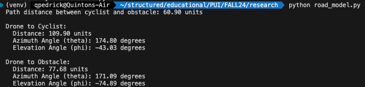
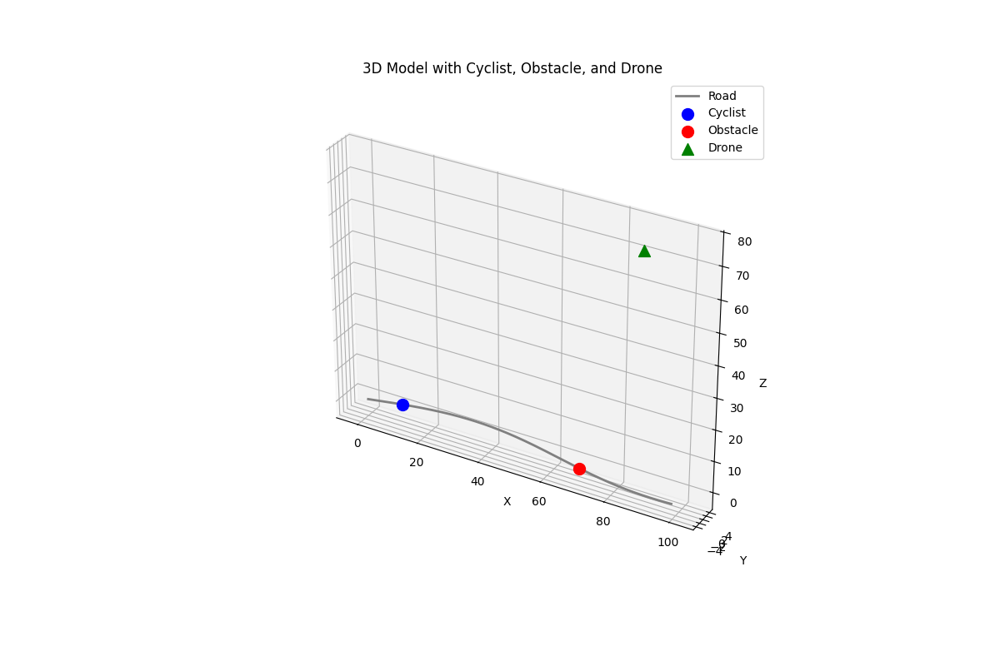
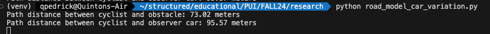

# Cyclist, Obstacle, and Observer Simulation in 3D Space

## Description

This project simulates a cyclist on a road with a curved path, an obstacle (pothole) ahead, and an observer (either a drone or an observer car) in 3D space using Python. The scripts model the scenario, calculate distances, and visualize the elements in a 3D plot.

## Table of Contents

- [Prerequisites](#prerequisites)
- [Installation](#installation)
- [Usage](#usage)
- [Script 1: Cyclist, Obstacle, and Drone](#script-1-cyclist-obstacle-and-drone)
- [Script 2: Cyclist, Obstacle, and Observer Car](#script-2-cyclist-obstacle-and-observer-car)
- [Outputs](#outputs)
- [Credits](#credits)

## Prerequisites

Python 3.x installed on your system
Familiarity with virtual environments

## Installation

1. Clone or Download the Repository
- Unzip the provided directory or clone the repository if applicable.
2. Navigate to the Project Directory

    ```bash cd path_to_project_directory ```

3. Create a Virtual Environment

    ```bash python -m venv venv ```

    - This will create a virtual environment named `venv`.

4. Activate the Virtual Environment

    - On Windows:

        ```bash venv\Scripts\activate ```
    - On macOS/Linux:

        ```bash source venv/bin/activate ```

5. Upgrade `pip` (Optional but Recommended)

    ```bash pip install --upgrade pip ```

6. Install the Required Packages

    ```bash pip install -r requirements.txt ```

    - If a `requirements.txt` file is not provided, install the packages manually:

        ```bash pip install numpy matplotlib scipy ```
## Usage

### Script 1: Cyclist, Obstacle, and Drone

**Description:**

- Simulates a cyclist on a road with a curved path, an obstacle (pothole) ahead, and a drone observing from above.
- Calculates the path distance between the cyclist and the obstacle.
- Visualizes the scenario in a 3D plot.

**Running the Script:**

1. Ensure the Virtual Environment is Activated

    - On Windows

        ```venv\Scripts\activate```

    - On macOS/Linux

        ```source venv/bin/activate```

2. Run the Script

    ```python road_model.py```

3. Expected Output
- A printout of the path distance between the cyclist and the obstacle.
- Angles from the drone to the cyclist and obstacle.
- A 3D plot visualizing the road, cyclist, obstacle, and drone.

**Sample Output:**



**Visualization:**



### Script 2: Cyclist, Obstacle, and Observer Car

**Description:**

- Simulates a more pronounced curved road, a cyclist, an obstacle, and an observer car with cameras mounted above.
- Calculates the path distances between the cyclist, obstacle, and observer car.
- Visualizes the scenario in a 3D plot.

**Running the Script:**

1. Ensure the Virtual Environment is Activated

    - On Windows

        ```venv\Scripts\activate```

    - On macOS/Linux

        ```source venv/bin/activate```

2. Run the Script

    ```python road_model_car_variation.py```

3. Expected Output
- Printout of the path distances between the cyclist and the obstacle, and between the cyclist and the observer car.
- A 3D plot visualizing the road, cyclist, obstacle, observer car, and cameras.

**Sample Output:**



**Visualization:**


## Outputs

- **Console Output:** Displays calculated distances and angles.
- **Visualization:** 3D plots generated by Matplotlib.

## Credits

This project was developed with assistance from ChatGPT.